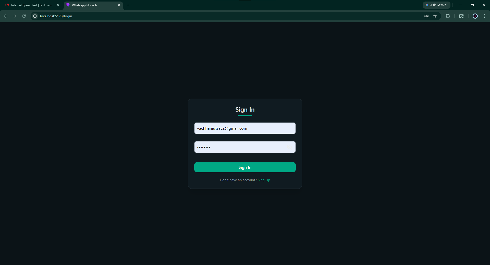
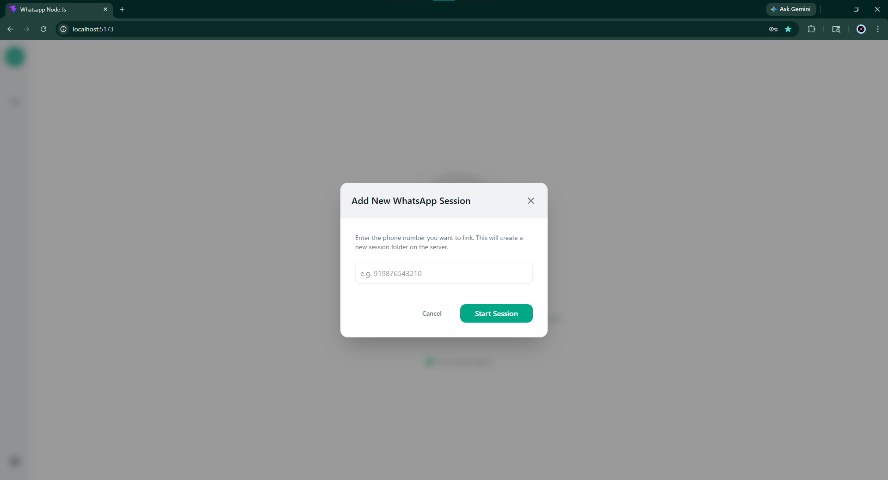
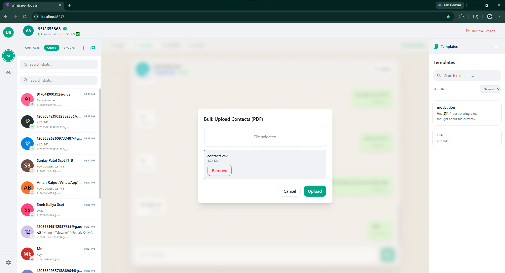
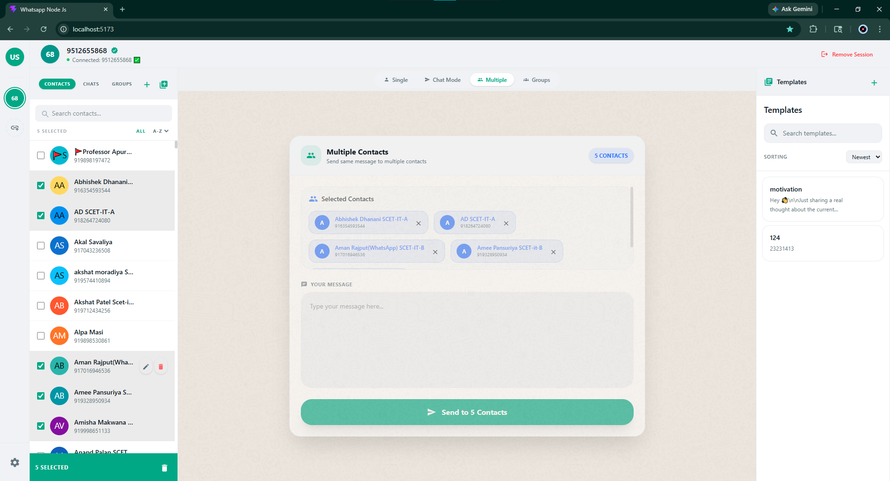

# 🚀 WhatsApp Messaging Portal (v6.0)

A powerful next-generation real-time WhatsApp automation and communication platform built using **MERN + Socket.IO + whatsapp-web.js + PostgreSQL**, designed for scalable messaging workflows, direct contact synchronization, personal chat management, bulk broadcasting, and modern SaaS-style communication systems.

Version **v6.0** introduces major upgrades with:

* 💬 Personal Chat System
* 📥 Advanced WhatsApp Contact Synchronization
* 👥 Enhanced Group Messaging
* 📤 Faster Multi-contact Broadcasting
* 🧠 Better Real-time Session Management
* 🎨 Fully Improved SaaS UI/UX
* ⚡ Optimized Real-time Architecture

---

# 🆕 What’s New in v6.0

## ✨ Major Upgrades

### 💬 Personal Chat System (NEW 🔥)

v6.0 now introduces a fully integrated **Personal Chat Module** allowing users to communicate directly with WhatsApp contacts in real-time.

Features include:

* Real-time personal chat interface
* Live incoming & outgoing messages
* Chat history management
* Persistent conversation storage
* Fast session-based communication
* WhatsApp-style messaging experience

✔ One-to-one messaging
✔ Real-time updates
✔ Persistent chat storage
✔ Modern conversation UI
✔ Incoming message detection

---

### 📥 Advanced WhatsApp Contact Synchronization

The platform can now:

* Fetch all WhatsApp contacts directly
* Sync saved & unsaved numbers
* Auto-store contacts into PostgreSQL
* Detect new contacts instantly
* Perform session-based synchronization
* Handle multi-user syncing efficiently

✔ Real-time contact importing
✔ Automatic database synchronization
✔ Improved fetch performance
✔ Session-aware syncing

---

### 👥 Improved Group Messaging System

Enhanced group communication workflows with:

* Real-time group fetching
* Better group selection experience
* Improved delivery speed
* Group-based broadcast optimization
* Delivery & failure tracking

---

### 📤 Enhanced Multi-Contact Broadcasting

Broadcast one message to multiple contacts instantly with:

* Faster message queue handling
* Improved delivery tracking
* Better failure handling
* Real-time status updates
* Optimized Socket.IO communication

---

### 🧾 Smart Template System

Save and reuse frequently used messages.

Features:

* Reusable templates
* Dynamic placeholders
* Faster communication workflows
* Quick template selection

---

### 🎨 Fully Redesigned Modern UI/UX

v6.0 introduces a more polished and production-ready SaaS experience.

Improvements include:

* Cleaner dashboard design
* Better responsive layouts
* Improved navigation
* Enhanced chat UI
* Better messaging workflows
* Modern session visualization
* Better user interaction flow

---

# 🏗️ Tech Stack

| Technology      | Usage                   |
| --------------- | ----------------------- |
| React.js        | Frontend                |
| Node.js         | Backend Runtime         |
| Express.js      | REST API Layer          |
| PostgreSQL      | Database                |
| Socket.IO       | Real-time Communication |
| whatsapp-web.js | WhatsApp Integration    |
| JWT             | Authentication          |
| bcrypt          | Password Security       |

---

# 📸 UI Screens (v6.0)

## 🔐 Authentication System

### 🟢 Signup Screen

Secure user registration system.


---

### 🟢 Login Screen

JWT-based secure login authentication.



---

## 🖥️ Dashboard System

### 🟢 Modern Home Dashboard

Modern SaaS-style dashboard with improved messaging workflows and session visibility.


---

## 📱 WhatsApp Session Management

### 🟢 WhatsApp Session Initialization

Displays real-time WhatsApp session connection flow.


---

### 🟢 WhatsApp QR Authentication

Secure QR-based WhatsApp authentication system.

Features:

* QR Scan Authentication
* Persistent Sessions
* Automatic Reconnection
* Real-time Session Status



---

## 👥 Contact Management System

### 🟢 Single Contact Management

Add and manage individual contacts.


---

### 🟢 Bulk Contact Management

Efficient multi-contact organization system.



---

### 🟢 WhatsApp Contact Synchronization 🔥

Directly fetch contacts from connected WhatsApp sessions.

Features:

* Real-time contact fetching
* Database auto-save
* Session-based synchronization
* Multi-user support


---

## 💬 Personal Chat System (NEW 🔥)

### 🟢 Real-time Personal Messaging

Chat directly with WhatsApp contacts in real-time.

Features:

* Live messaging
* Incoming message detection
* Persistent conversation history
* Fast chat synchronization
* Modern chat interface


---

## 📤 Multi-Contact Messaging

### 🟢 Bulk Messaging System

Broadcast one message to multiple contacts instantly.

Features:

* Bulk message delivery
* Delivery tracking
* Failed message handling
* Real-time updates



---

## 👥 Group Messaging System

### 🟢 WhatsApp Group Messaging

Send messages directly to WhatsApp groups.

Features:

* Fetch joined groups
* Group broadcasting
* Real-time delivery tracking
* Multiple group support


---

## 💬 Chat Mode Interface

### 🟢 Modern Chat Workflow

Enhanced WhatsApp-style communication layout.

Features:

* Better messaging flow
* Modern UI experience
* Real-time communication
* Improved responsiveness


---

# ⚙️ Core Features

| Feature                | Description                    |
| ---------------------- | ------------------------------ |
| 🔐 Authentication      | Secure Login & Signup          |
| 📱 QR Session          | WhatsApp Authentication        |
| 📥 Contact Sync        | Fetch WhatsApp Contacts        |
| 👥 Contacts            | Contact Management             |
| 💬 Personal Chat       | Real-time One-to-One Messaging |
| 📤 Bulk Messaging      | Multi-contact Broadcasting     |
| 👥 Group Messaging     | WhatsApp Group Messaging       |
| 🧾 Templates           | Reusable Message Templates     |
| ⚡ Socket.IO            | Real-time Communication        |
| 🗄️ PostgreSQL         | Database Management            |
| 🔄 Session Persistence | Stable WhatsApp Sessions       |
| 🎨 Modern UI           | SaaS-style Interface           |

---

# 🔥 Core Workflows

## 📥 Contact Synchronization Flow

```text
Connect WhatsApp → Fetch Contacts → Save to PostgreSQL → Real-time Sync
```

---

## 💬 Personal Chat Flow

```text
Select Contact → Open Chat → Send/Receive Messages → Save Conversation
```

---

## 📤 Multi-Contact Messaging Flow

```text
Select Contacts → Write Message → Send → Track Delivery → Real-time Updates
```

---

## 👥 Group Messaging Flow

```text
Fetch Groups → Select Groups → Write Message → Send → Delivered
```


---

# ⚡ Real-Time System Features

The platform now provides:

* ✅ Real-time incoming messages
* ✅ Instant delivery updates
* ✅ Live session monitoring
* ✅ Socket.IO-based communication
* ✅ Automatic reconnection handling
* ✅ Real-time synchronization

---

# 🔐 Session Management

Enhanced WhatsApp session architecture provides:

* Persistent login sessions
* Stable WhatsApp connectivity
* Session recovery support
* Real-time session state updates
* Improved reconnection handling

---

# ✅ Improvements Made in v6.0

* ✅ Added Personal Chat System
* ✅ Improved WhatsApp Contact Synchronization
* ✅ Enhanced Group Messaging
* ✅ Faster Multi-contact Broadcasting
* ✅ Better Real-time Messaging
* ✅ Improved Session Stability
* ✅ Better SaaS-style UI/UX
* ✅ Improved Database Architecture
* ✅ Enhanced Socket.IO Communication
* ✅ Better Delivery Tracking

---

# 🚀 Future Scope

This platform is designed to evolve into a complete:

* WhatsApp CRM
* AI-powered Messaging Platform
* Customer Support System
* Marketing Automation Solution
* Multi-user SaaS Communication Platform
* Enterprise Messaging Infrastructure

---

# 💡 Highlights

✔ Real-time WhatsApp Integration
✔ Personal Chat System
✔ WhatsApp Contact Synchronization
✔ PostgreSQL Database Support
✔ Bulk Messaging System
✔ Group Messaging Support
✔ Template Management
✔ Modern SaaS UI
✔ Persistent Sessions
✔ Production-ready Architecture

---

# 🚀 Project Vision

The vision of **v6.0** is to provide a scalable and production-ready WhatsApp communication ecosystem capable of:

* Real-time personal chatting
* Advanced bulk messaging
* Group communication workflows
* WhatsApp contact synchronization
* Stable session management
* Enterprise-level messaging workflows

---

# ⭐ Conclusion

Version **v6.0** transforms the project into a complete real-time WhatsApp communication platform with:

* 💬 Personal Chat System
* 📥 Contact Synchronization
* 👥 Group Messaging
* 📤 Bulk Messaging
* 🗄️ PostgreSQL Integration
* ⚡ Real-time Socket.IO Communication
* 🎨 Modern SaaS-style UI/UX

This version now feels significantly closer to a real-world production-grade WhatsApp communication and automation platform.
