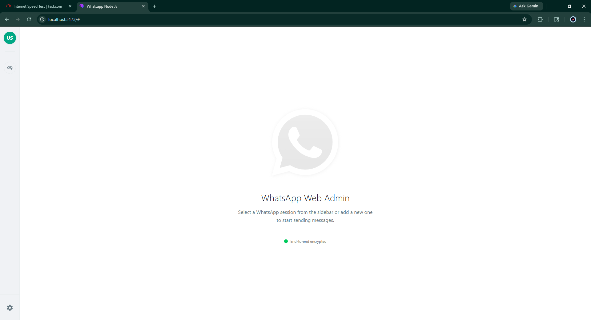
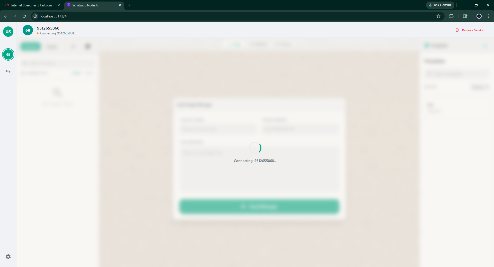
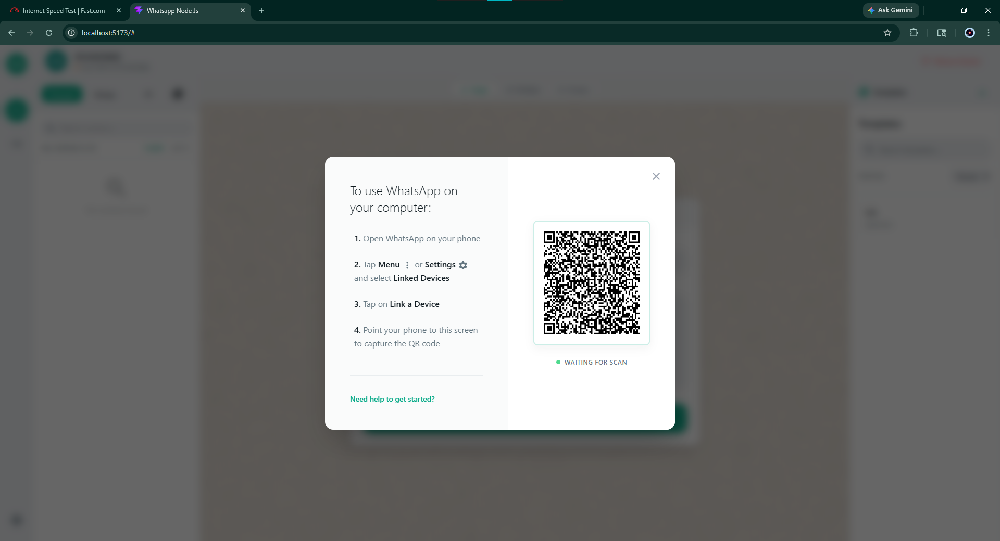
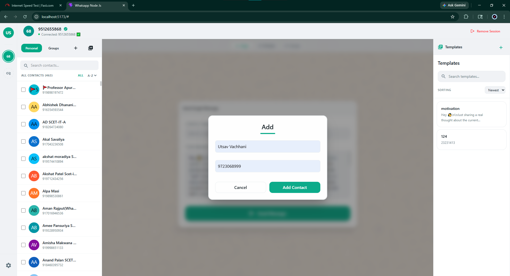
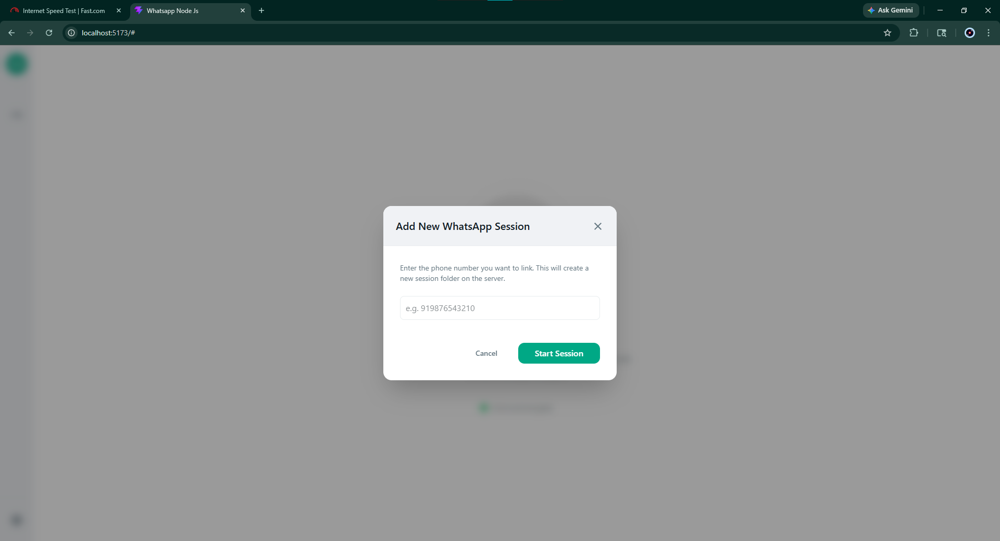
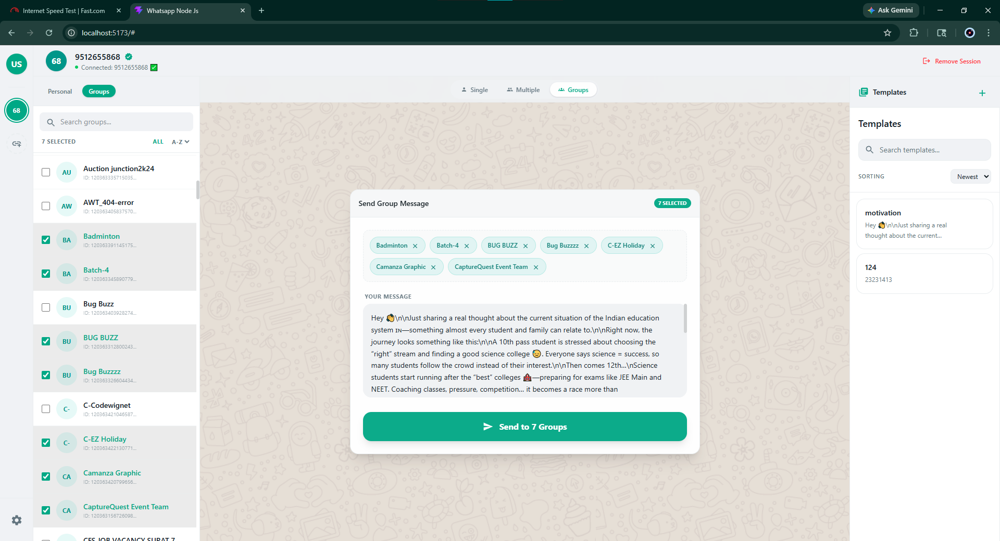
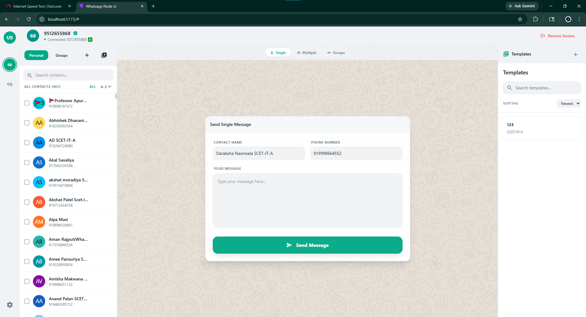
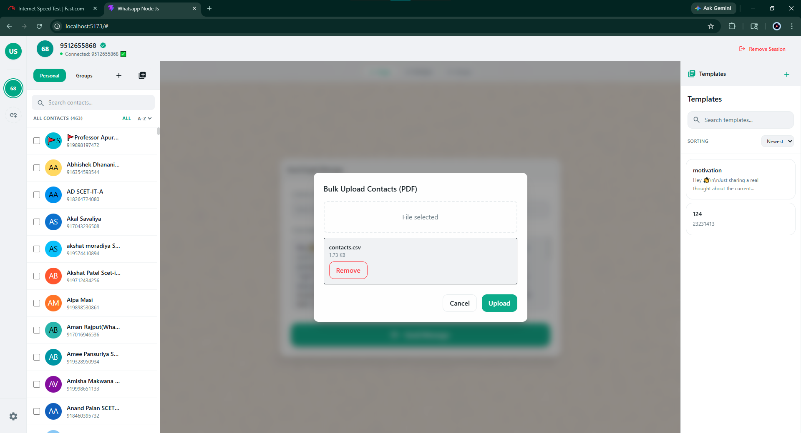

# 🚀 WhatsApp Messaging Portal (v5.0)

A next-generation real-time WhatsApp automation platform built using **MERN + Socket.IO + whatsapp-web.js + PostgreSQL**, designed for powerful communication workflows, contact synchronization, bulk messaging, and modern SaaS-style management.

Version **v5.0** introduces a major upgrade with:

- 📲 Direct WhatsApp Contact Fetching
- 📥 Direct WhatsApp Contact Fetching
- 🎨 Enhanced Modern UI/UX
- 👥 Advanced Messaging Workflows
- 🔥 Better Group & Multi-contact Management

---

# 🆕 What’s New in v5.0

## ✨ Major Upgrades

### 📥 Direct WhatsApp Contact Fetching (NEW 🔥)

The system can now:

- Fetch all WhatsApp contacts directly from active sessions
- Sync saved and unsaved contacts automatically
- Store contacts into PostgreSQL database
- Detect new contacts in real-time
- Support multi-user contact synchronization

✔ Real-time contact importing
✔ Database auto-save support
✔ Session-based fetching
✔ Optimized sync handling

---

### 🎨 Improved Modern UI/UX

v5.0 introduces a cleaner SaaS-style interface with:

- Better layout structure
- Improved responsive design
- Modern dashboard styling
- Cleaner messaging flows
- Enhanced navigation experience
- Better WhatsApp session visualization

---

### 👥 Advanced Group Messaging

Now improved with:

- Real-time group fetching
- Better group selection flow
- Faster bulk delivery
- Improved delivery tracking

---

### 📤 Enhanced Multi-Contact Messaging

- Send one message to multiple contacts instantly
- Optimized bulk delivery flow
- Better success/failure tracking
- Improved real-time updates

---

### 🧾 Template System

- Save reusable templates
- Faster communication workflows
- Dynamic message handling

---

---

# 🏗️ Tech Stack

| Technology      | Usage                |
| --------------- | -------------------- |
| React.js        | Frontend             |
| Node.js         | Backend Runtime      |
| Express.js      | API Layer            |
| PostgreSQL      | Database             |
| whatsapp-web.js | WhatsApp Integration |
| JWT             | Authentication       |
| bcrypt          | Password Security    |

---

# 📸 UI Screens (v5.0)

## 🖥️ Main Dashboard

### 🟢 Improved Home Screen

Modernized dashboard with improved messaging controls and session visibility.



---

## 📡 WhatsApp Session System

### 🟢 Connecting WhatsApp Session

Displays real-time WhatsApp session connection process.



---

### 🟢 QR Authentication System

Secure QR-based authentication flow for WhatsApp sessions.



Features:

- QR Scan Authentication
- Session Persistence
- Reconnection Support
- Real-time Status

---

## 👥 Contact Management System

### 🟢 Add Single Contact

Allows manual contact creation.



---

### 🟢 Multi-Contact Management

Manage and organize multiple contacts efficiently.



---


## 👥 WhatsApp Group Messaging

### 🟢 Group Messaging System

Send messages directly to WhatsApp groups.



Features:

- Fetch joined groups
- Send bulk group messages
- Real-time delivery handling
- Multiple group support

---

## 💬 Messaging System

### 🟢 Single Contact Messaging

Send messages to individual users.



---

### 🟢 Multi-Contact Messaging 🔥

Broadcast one message to multiple contacts.



Features:

- Bulk sending
- Delivery tracking
- Failure handling
- Real-time updates

---

## 📡 Session & Delivery Status

### 🟢 Real-Time Message Response System

The system provides:

- ✅ Message Sent Status
- 📩 Incoming Message Detection
- ⚠️ Failed Delivery Alerts
- 🔄 Session State Updates

---

## 🔐 Session Management

### 🟢 Added Session Handling

Improved session management architecture for stable WhatsApp connectivity.
---

# ⚙️ Key Features

| Feature            | Description                |
| ------------------ | -------------------------- |
| 🔐 Authentication  | Secure Login & Register    |
| 📱 QR Session      | WhatsApp Authentication    |
| 📥 Contact Sync    | Fetch WhatsApp Contacts    |
| 👥 Contacts        | Manage Contacts            |
| 💬 Messaging       | Real-time Messaging        |
| 📤 Bulk Messaging  | Multi-contact Broadcasting |
| 👥 Group Messaging | WhatsApp Group Messaging   |
| 🧾 Templates       | Reusable Message Templates |
| ⚡ Socket.IO       | Live Real-time Updates     |
| 🗄️ PostgreSQL      | Database Management        |
| 🌙 Modern UI       | Improved Interface         |

---

# 🔥 Core Workflow

## 📥 Contact Sync Flow

```text
Connect WhatsApp → Fetch Contacts → Save to PostgreSQL → Real-time Sync
```

---

## 📤 Multi-Contact Messaging Flow

```text
Select Contacts → Write Message → Send → Track Delivery → Real-time Status
```

---

## 👥 Group Messaging Flow

```text
Fetch Groups → Select Group(s) → Write Message → Send → Delivered
```

---

# 🗄️ Database Architecture

v5.0 now supports improved PostgreSQL structures:

```text
users
contacts
messages
default_messages
whatsapp_sessions
groups
group_members
logs
media_files
```

---

---

---

# ✅ Improvements Made in v5.0

- ✅ Added Direct WhatsApp Contact Fetching
- ✅ Improved UI/UX Design
- ✅ Better Session Handling
- ✅ Improved Messaging Flow
- ✅ Enhanced Group Messaging
- ✅ Improved WhatsApp Contact Synchronization
- ✅ Improved SaaS-style Documentation

---

# 🚀 Future Scope

This platform is designed to scale into a complete:

- WhatsApp CRM
- Customer Support System
- Marketing Automation Platform
- SaaS Messaging Solution
- AI-powered Communication System

---

# 💡 Highlights

✔ Real-time WhatsApp Integration
✔ PostgreSQL Database Support
✔ Modern SaaS UI Design
✔ Bulk Messaging System
✔ Group Messaging Support
✔ Direct Contact Fetching
✔ Session Persistence
✔ Production-style Architecture

---

# 🚀 Project Vision

The goal of v5.0 is to provide a scalable and production-ready WhatsApp communication platform capable of:

- WhatsApp contact synchronization
- Better bulk messaging workflows
- Group messaging support
- Cleaner user management
- Improved WhatsApp session handling

---

# ⭐ Conclusion

Version **v5.0** transforms the project from a basic WhatsApp sender into a more advanced real-time communication platform with:

- WhatsApp contact synchronization
- Group messaging
- Bulk messaging
- PostgreSQL integration
- Modern SaaS UI experience

This version now feels much closer to a real-world production messaging platform.
