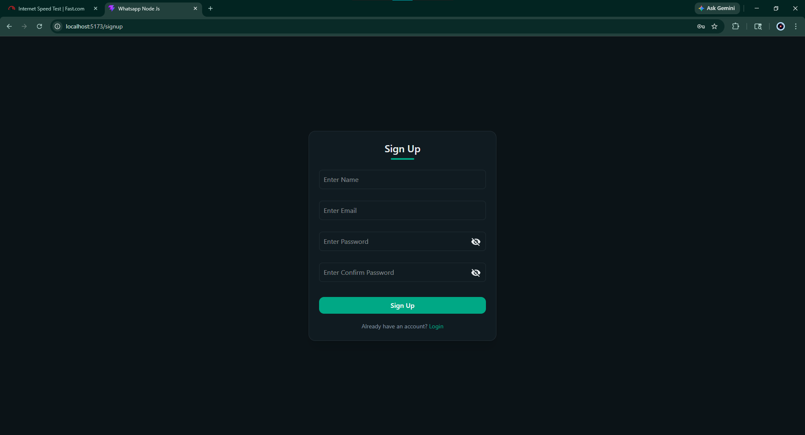
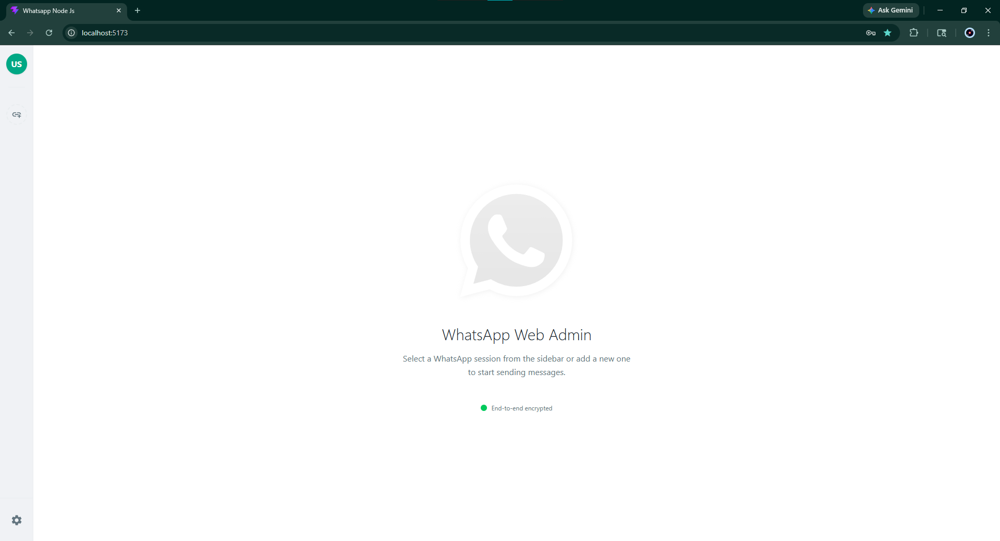
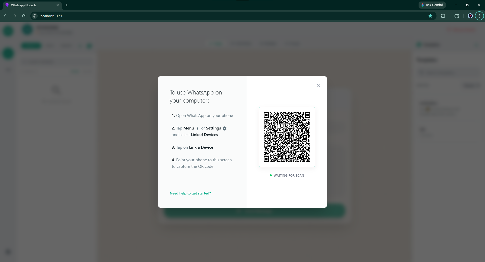
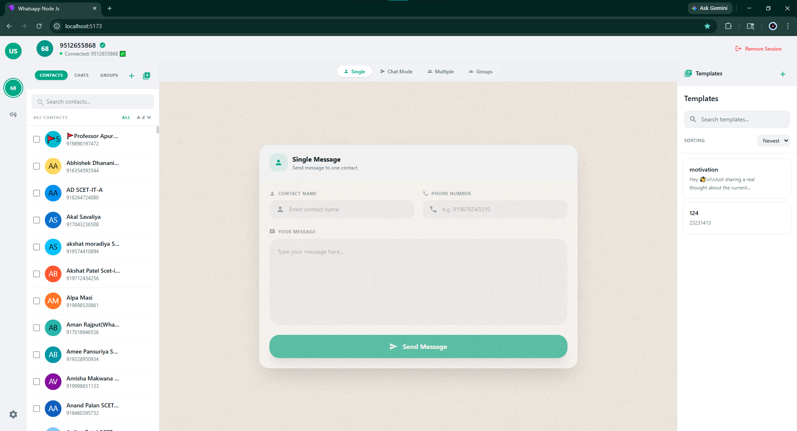
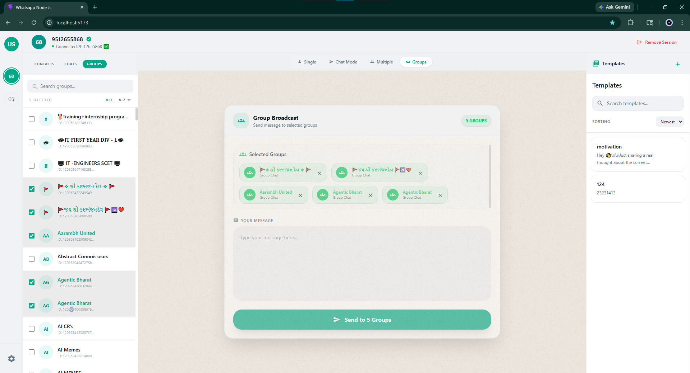
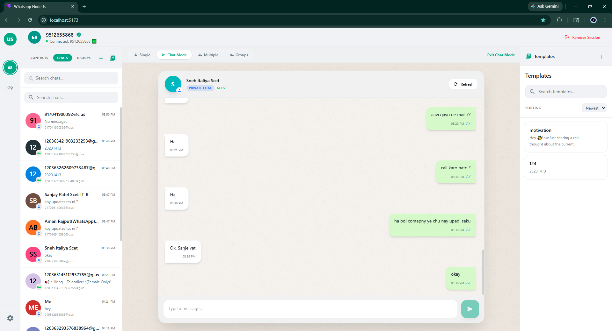
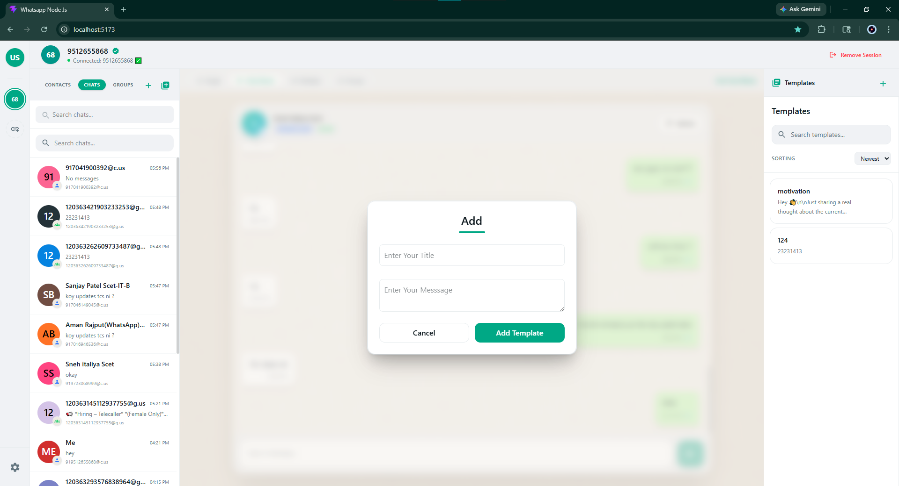
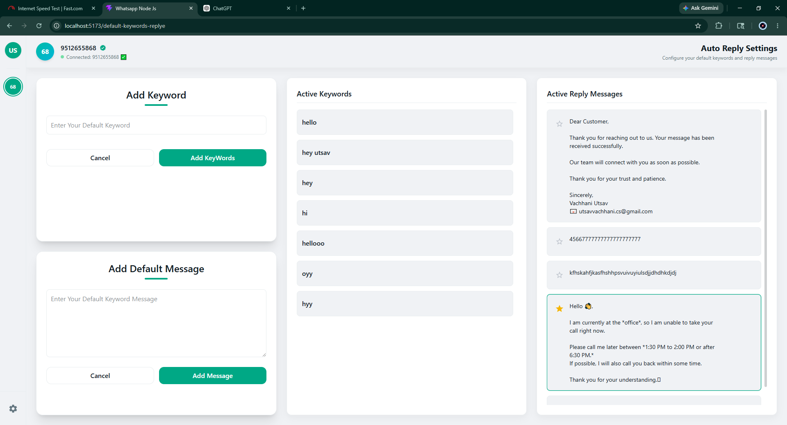

# 🚀 WhatsApp Messaging Portal (v7.0)

A real-time WhatsApp messaging and automation platform built using **MERN + Socket.IO + whatsapp-web.js + PostgreSQL**.

The project focuses on:

* Real-time WhatsApp communication
* Personal chat management
* Bulk messaging workflows
* WhatsApp contact synchronization
* Group messaging
* Keyword-based auto reply automation
* Stable session handling

Version **v7.0** introduces a new **Auto Reply System**, improved messaging workflows, and better real-time communication handling.

---

# 🆕 What’s New in v7.0

## 🤖 Auto Reply System (NEW 🔥)

Version **v7.0** introduces an automatic reply feature that responds to incoming WhatsApp messages based on configured keywords.

The system listens for incoming messages and automatically sends predefined responses when matching keywords are detected.

### Features

* Keyword-based reply detection
* Custom auto reply messages
* Real-time incoming message handling
* Session-based automation
* Instant response sending

### Example

```text id="0r5jxm"
Incoming Message: "pricing"
Auto Reply: "Hello 👋 Here is our pricing information."
```

---

## 💬 Personal Chat System

Chat directly with WhatsApp contacts in real-time.

Features include:

* Real-time messaging
* Incoming & outgoing messages
* Conversation history
* Persistent message storage
* WhatsApp-style chat interface

---

## 📥 WhatsApp Contact Synchronization

Synchronize WhatsApp contacts directly into PostgreSQL.

Features:

* Fetch saved & unsaved contacts
* Automatic database storage
* Session-based synchronization
* Real-time contact importing

---

## 📤 Bulk Messaging System

Send one message to multiple contacts instantly.

Features:

* Multi-contact broadcasting
* Delivery tracking
* Failed message handling
* Real-time updates

---

## 👥 Group Messaging

Send messages directly to WhatsApp groups.

Features:

* Fetch joined groups
* Group-based messaging
* Multiple group support
* Delivery status tracking

---

# 🏗️ Tech Stack

| Technology      | Usage                   |
| --------------- | ----------------------- |
| React.js        | Frontend                |
| Node.js         | Backend Runtime         |
| Express.js      | REST API Layer          |
| PostgreSQL      | Database                |
| Socket.IO       | Real-time Communication |
| whatsapp-web.js | WhatsApp Integration    |
| JWT             | Authentication          |
| bcrypt          | Password Security       |

---

# 📸 UI Screens (v7.0)

## 🔐 Authentication

### 🟢 Signup Screen

User registration system.



---

### 🟢 Login Screen

JWT-based login authentication.


---

# 🖥️ Dashboard

### 🟢 Home Dashboard

Main dashboard for managing messaging workflows and WhatsApp sessions.



---

# 📱 WhatsApp Session Management

### 🟢 WhatsApp Connection Screen

Real-time WhatsApp session initialization.


---

### 🟢 QR Authentication

QR-based WhatsApp login system.



---

# 👥 Contact Management

### 🟢 Single Contact

Add and manage individual contacts.



---

### 🟢 Bulk Contacts

Manage multiple contacts together.


---

### 🟢 WhatsApp Contact Sync

Synchronize contacts directly from WhatsApp.



---

# 💬 Personal Chat System

### 🟢 Real-time Chat Interface

Chat directly with WhatsApp contacts.



---

# 🤖 Auto Reply System

### 🟢 Keyword-based Auto Reply

Automatically reply to incoming messages using predefined keywords.

Features:

* Keyword matching
* Automatic response sending
* Real-time detection
* Session-based processing


---

# 📤 Bulk Messaging

### 🟢 Multi-contact Messaging

Broadcast messages to multiple contacts.


---

# 👥 Group Messaging

### 🟢 WhatsApp Group Messaging

Send messages directly to WhatsApp groups.



---

# 💬 Chat Mode

### 🟢 Messaging Workflow Interface

WhatsApp-style communication layout.



---

# ⚙️ Core Features

| Feature              | Description                  |
| -------------------- | ---------------------------- |
| 🔐 Authentication    | Login & Signup               |
| 📱 QR Session        | WhatsApp Authentication      |
| 📥 Contact Sync      | Fetch WhatsApp Contacts      |
| 💬 Personal Chat     | Real-time Messaging          |
| 🤖 Auto Reply System | Keyword-based Auto Responses |
| 📤 Bulk Messaging    | Multi-contact Broadcasting   |
| 👥 Group Messaging   | WhatsApp Group Communication |
| ⚡ Socket.IO          | Real-time Communication      |
| 🗄️ PostgreSQL       | Database Management          |
| 🔄 Sessions          | Persistent WhatsApp Sessions |

---

# 🔥 Workflows

## 🤖 Auto Reply Flow

```text id="50g2qj"
Incoming Message → Detect Keyword → Send Auto Reply
```

---

## 💬 Chat Flow

```text id="zv7l8m"
Select Contact → Open Chat → Send/Receive Messages
```

---

## 📤 Bulk Messaging Flow

```text id="9t2bwh"
Select Contacts → Write Message → Send Broadcast
```

---

# ✅ Improvements in v7.0

* ✅ Added Auto Reply System
* ✅ Improved Personal Chat
* ✅ Better Real-time Messaging
* ✅ Enhanced Contact Synchronization
* ✅ Improved Bulk Messaging
* ✅ Better Session Handling
* ✅ Improved Socket.IO Communication

---

# 🚀 Future Improvements

Planned future upgrades:

* Better responsive UI
* AI-powered replies
* Scheduled messaging
* Improved dashboard UI
* Better analytics
* Multi-user support enhancements

---

# ⭐ Conclusion

Version **v7.0** improves the platform with:

* 🤖 Auto Reply Automation
* 💬 Personal Chat
* 📥 Contact Synchronization
* 📤 Bulk Messaging
* 👥 Group Messaging
* ⚡ Real-time Communication

The project continues evolving as a real-time WhatsApp communication and automation platform with improved messaging workflows and automation capabilities.
