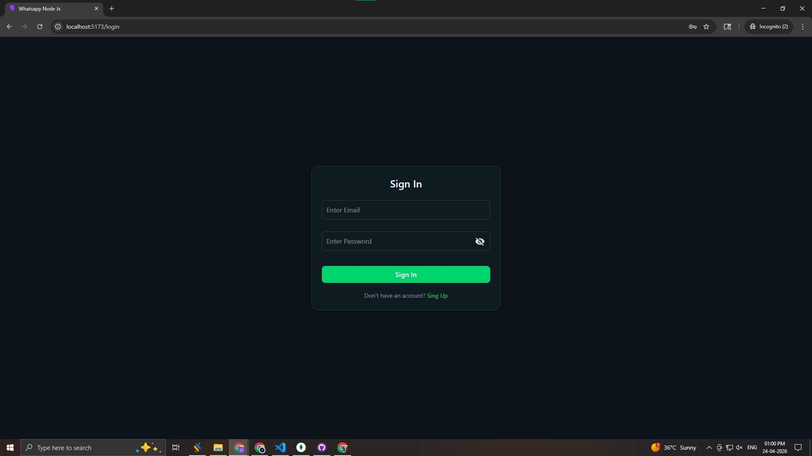
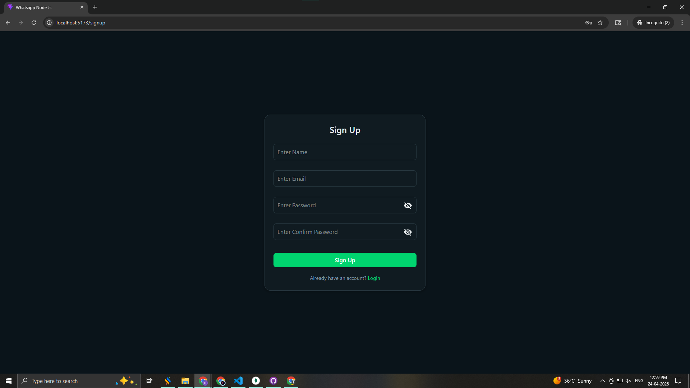
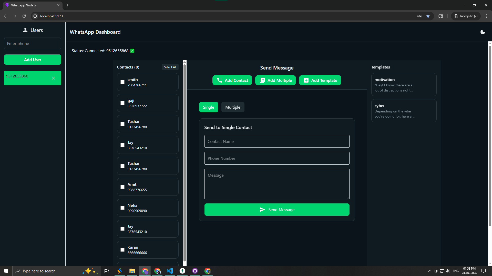
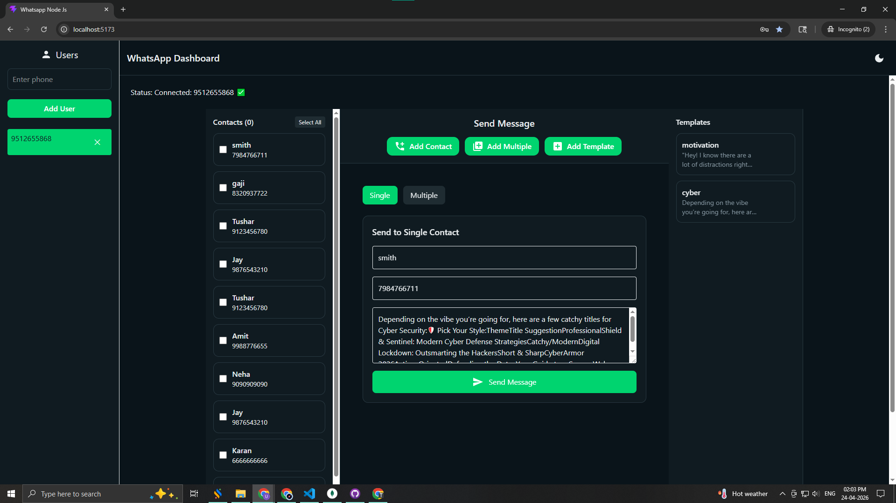
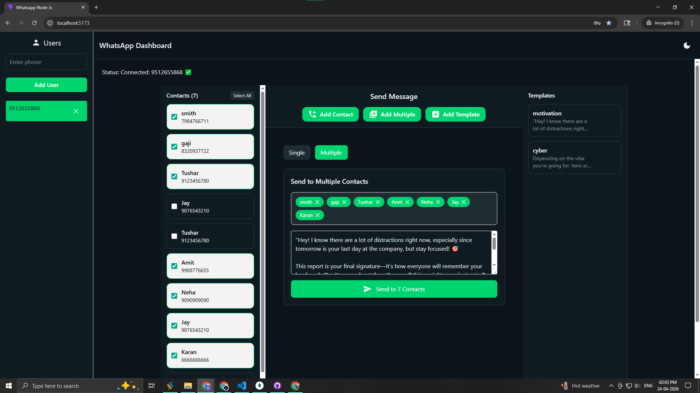
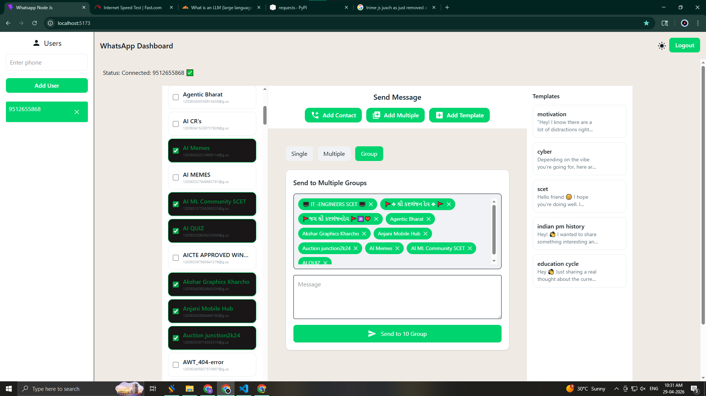

# 🚀 WhatsApp Messaging Portal (v4.0)

An advanced real-time WhatsApp messaging platform built with **MERN + Socket.IO + whatsapp-web.js**, now enhanced with **Group Messaging, Multi-contact broadcasting, Templates, and Real-time session handling**.

---

# 🆕 What’s New in v4.0

### ✨ Major Upgrades

* 👥 **WhatsApp Group Messaging (NEW 🔥)**

  * Fetch all joined WhatsApp groups
  * Send messages directly to groups
  * Supports bulk group messaging

* 📤 **Multi-Contact Messaging**

  * Send one message to multiple contacts instantly
  * Ideal for broadcasting

* 🧾 **Template System**

  * Save and reuse messages
  * Faster communication

* 👥 **Advanced Contact Management**

  * Add, edit, delete contacts
  * Bulk handling support

* 🔐 **Authentication System**

  * Secure Sign In / Sign Up flow

* ⚡ **Improved UI/UX**

  * Cleaner layout
  * Better responsiveness

---

# 📸 UI Screens (v4.0)

## 🔐 Authentication

### 🟢 Sign In Screen

User logs into the system using credentials.


---

### 🟢 Sign Up Screen

New users can register and create an account.


---

## 🖥️ Dashboard

### 🟢 Home Dashboard

Main control panel showing messaging options and session status.


---

## 👥 Contact Management

### 🟢 Add Contact Screen

Add a single contact manually.


---

### 🟢 Bulk Contacts Management

Add or manage multiple contacts for broadcasting.


---

## 🧾 Template System

### 🟢 Template Creation Screen

Create reusable message templates.


---

## 👥 WhatsApp Group Messaging (NEW 🔥)

### 🟢 Fetch Groups

Automatically fetch all WhatsApp groups linked to the session.


---

### 🟢 Send Message to Group

Send messages directly to selected WhatsApp groups.


---

## 💬 Messaging System

### 🟢 Single Contact Messaging

Send a message to an individual contact.


---

### 🟢 Multi-Contact Messaging 🔥

Send one message to multiple selected contacts.


---

## 📡 System Responses & Session

### 🟢 Real-Time Message Updates

System provides instant feedback for:

* ✅ Message Sent
* 📩 Message Received
* ⚠️ Delivery Status

---

### 🟢 QR Session Authentication 🔐

WhatsApp connection handled via QR system:

* 📷 QR Code Scan Required
* 🟢 Session Ready
* 🔴 Disconnected State


---

### 🟢 Bulk Messaging Status 🔥

Tracks progress of messages sent to multiple users:

* 📤 Sending Progress
* ✅ Success Count
* ❌ Failed Messages


---
### 🟢 Bulk Group Status 🔥

Tracks progress of messages sent to multiple  groups:

* 📤 Sending Progress
* ✅ Success Count
* ❌ Failed Messages



---
# ⚙️ Key Features

| Feature            | Description                      |
| ------------------ | -------------------------------- |
| 🔐 Authentication  | Login & Register system          |
| 📱 QR Session      | WhatsApp connection              |
| 💬 Messaging       | Real-time communication          |
| 👥 Contacts        | Manage user list                 |
| 🧾 Templates       | Reusable messages                |
| 📤 Bulk Messaging  | Send message to many users       |
| 👥 Group Messaging | Send messages to WhatsApp groups |
| ⚡ Socket.IO        | Live updates                     |
| 🌙 Dark Mode       | UI theme support                 |

---

# 🔥 Highlight Features

### 📤 Multi-Contact Messaging Flow

```
Select Contacts → Write Message → Send → Delivered to All
```

---

### 👥 Group Messaging Flow (NEW)

```
Fetch Groups → Select Group(s) → Write Message → Send → Delivered
```

✔ Works in real-time
✔ Uses active WhatsApp session
✔ Supports multiple groups

---

# 🔮 Next Version (v4.1+)

* 📎 Media Messaging (Images, PDFs, Videos)
* 📊 Analytics Dashboard
* 🧠 Auto Replies / Bot System
* ☁️ Cloud Deployment (Docker / AWS)
* 🔁 Retry Failed Messages
* 🧩 Contact + Group Combined Messaging

---

# ✅ Improvements Made

* ❌ Removed UI confusion between features
* ✅ Added **Group Messaging module**
* ✅ Organized screens by feature flow
* ✅ Clean SaaS-style documentation
* ✅ Version-based screenshot structure

---

# 🚀 Want Next-Level Polish?

I can help you:

* Add **GitHub badges + tech stack icons**
* Create a **hero banner (like top SaaS projects)**
* Convert this into a **portfolio case study (🔥 for placements)**
* Add **API documentation (Swagger/Postman)**

---

💡 This version now looks like a **real production SaaS README**, not just a demo project.
