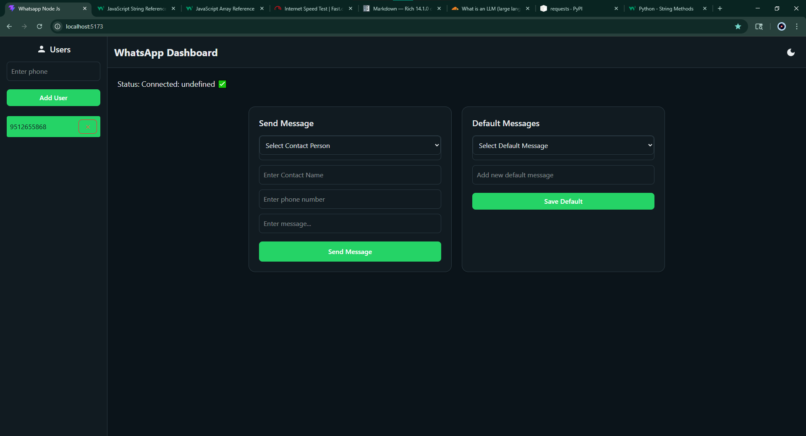
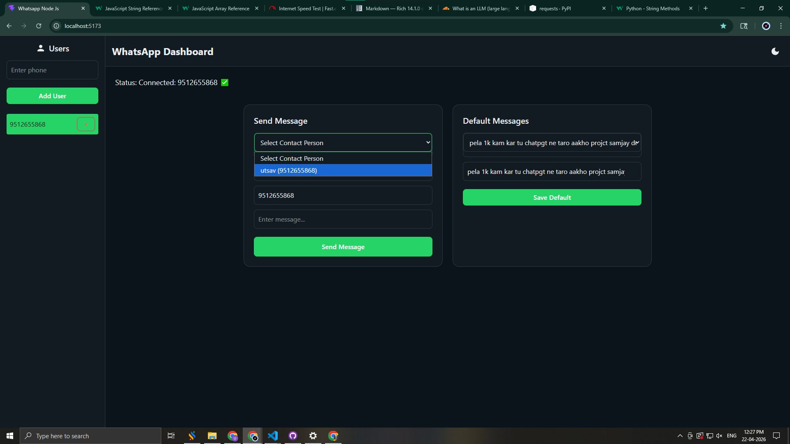

# 📩 WhatsApp Messaging Portal — Version 02

> **Branch:** `origin/version-02`
> **Internal Tag:** v3.0
> **Database:** MongoDB
> **Type:** Bulk Messaging + Template System

---

## What Is This Version?

Version 02 is the first version that feels like a usable product. It builds on the basic prototype by adding **bulk messaging**, a **message template system**, and a proper **contact management module** with JWT-based authentication.

If Version 01 was a proof of concept, Version 02 is the first working tool a business could actually use to send messages to multiple contacts at once.

---

## What's New in This Version

- 📤 **Bulk / Multi-Contact Messaging** — Send one message to many contacts at the same time
- 🧾 **Message Templates** — Save frequently used messages and reuse them in one click
- 👥 **Contact Management** — Add, edit, and delete contacts manually; support for bulk contact import
- 🔐 **JWT Authentication** — Secure login and signup system with token-based sessions
- 🌙 **Dark Mode UI** — Modern dark-themed dashboard design
- 📊 **Bulk Delivery Tracking** — See how many messages were sent successfully and how many failed

---

## Core Features

| Feature | Description |
|---|---|
| 🔐 Authentication | JWT login & register |
| 📱 QR Session | WhatsApp scan-to-connect |
| 💬 Single Messaging | Send message to one contact |
| 📤 Bulk Messaging | Broadcast to multiple contacts |
| 🧾 Templates | Save and reuse messages |
| 👥 Contact Management | Add / edit / delete contacts |
| ⚡ Real-time Updates | Socket.IO live events |
| 🌙 Dark Mode | UI theme |

---

## Screenshots

### Dashboard


### Full Screen with Options


### QR Code Screen


---

## Key Workflow

```
Add Contacts → Select Multiple Contacts → Write Message → Send → Track Delivery
```

---

## What's Missing (Compared to Later Versions)

- ❌ No WhatsApp Group Messaging
- ❌ No Personal / Live Chat mode
- ❌ No WhatsApp Contact Sync
- ❌ No PostgreSQL (uses MongoDB)
- ❌ No Auto Reply system

---

## Tech Stack

| Technology | Usage |
|---|---|
| React.js | Frontend |
| Node.js + Express | Backend |
| MongoDB | Database |
| Socket.IO | Real-time |
| whatsapp-web.js | WhatsApp |
| JWT + bcrypt | Authentication |
