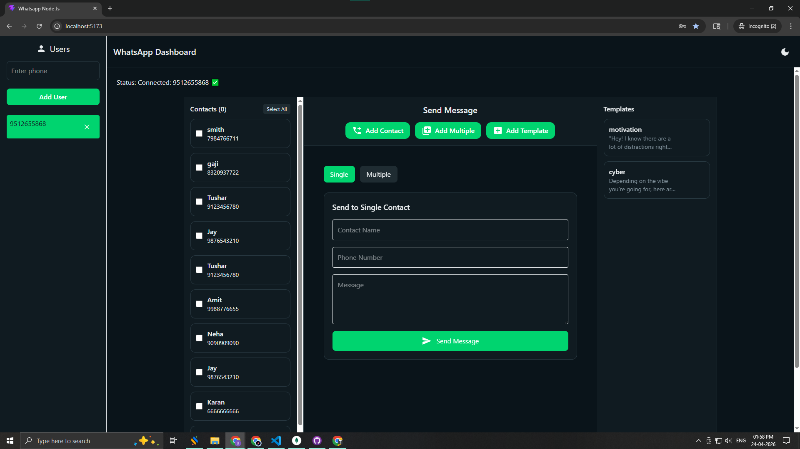
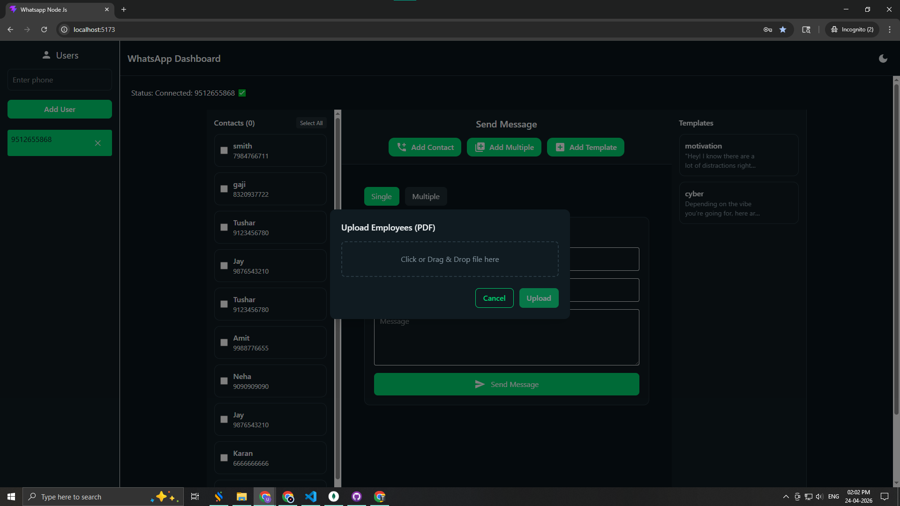
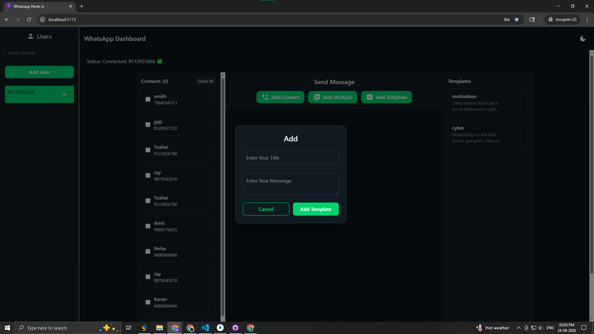
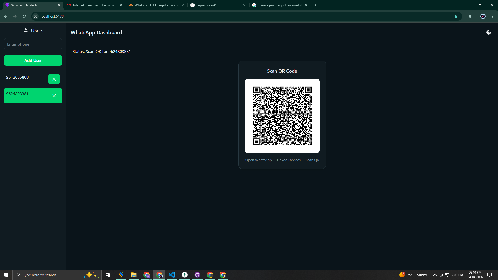

# 📩 WhatsApp Messaging Portal — Version 03

> **Branch:** `origin/version-03`
> **Internal Tag:** v4.0
> **Database:** MongoDB → PostgreSQL transition
> **Type:** Group Messaging added on top of v02

---

## What Is This Version?

Version 03 takes everything from Version 02 and introduces **WhatsApp Group Messaging** for the first time. You can now fetch all WhatsApp groups that the connected session has joined, and send messages directly to one or multiple groups — with delivery tracking.

---

## What's New in This Version

- 👥 **WhatsApp Group Messaging (NEW)** — Fetch joined groups and send messages directly to them
- 📤 **Group Broadcast** — Send one message to multiple groups at once
- 📊 **Group Delivery Tracking** — Track how many group messages were delivered or failed
- ✅ All features from Version 02 are retained

---

## Core Features

| Feature | Description |
|---|---|
| 🔐 Authentication | JWT login & register |
| 📱 QR Session | WhatsApp scan-to-connect |
| 💬 Single Messaging | Send to one contact |
| 📤 Bulk Messaging | Broadcast to multiple contacts |
| 👥 Group Messaging | Send messages to WhatsApp groups |
| 🧾 Templates | Save and reuse messages |
| 👥 Contact Management | Add / edit / delete contacts |
| ⚡ Socket.IO | Real-time updates |

---

## Screenshots

### Login


### Sign Up


### Home Dashboard


### Add Contact


### Bulk Contacts View


### Template System


### Single Person Messaging


### Multi-Contact Messaging


### QR Authentication


---

## Key Workflows

```
Group Messaging:
Fetch Groups → Select Group(s) → Write Message → Send → Delivered

Bulk Contact Messaging:
Select Contacts → Write Message → Send → Track Delivery
```

---

## What's Missing (Compared to Later Versions)

- ❌ No Personal / Live Chat mode
- ❌ No WhatsApp Contact Sync
- ❌ No Auto Reply system
- ❌ No PostgreSQL yet

---

## Tech Stack

| Technology | Usage |
|---|---|
| React.js | Frontend |
| Node.js + Express | Backend |
| MongoDB | Database |
| Socket.IO | Real-time |
| whatsapp-web.js | WhatsApp |
| JWT + bcrypt | Authentication |
