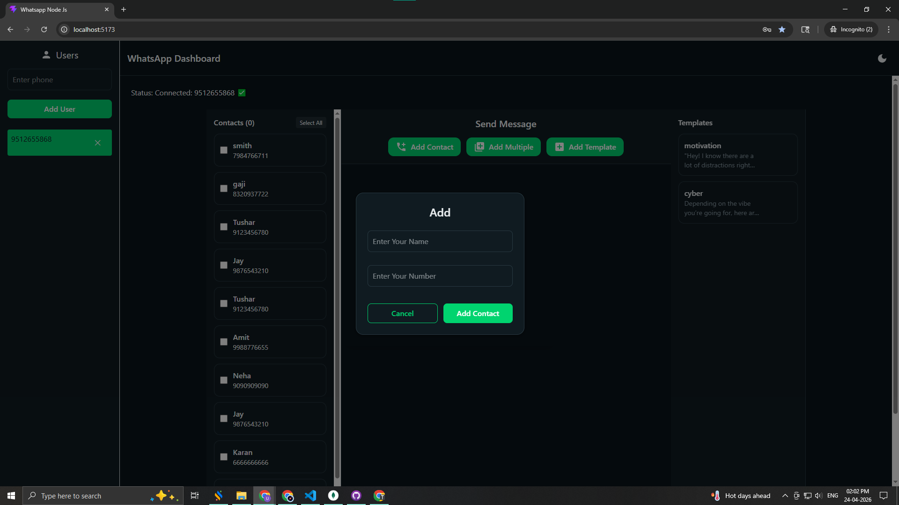

# 📩 WhatsApp Messaging Portal — Version 04

> **Branch:** `origin/version-04`
> **Internal Tag:** v6.0
> **Database:** PostgreSQL
> **Type:** Personal Live Chat + Contact Sync + Full Platform Upgrade

---

## What Is This Version?

Version 04 is the **biggest upgrade in the entire series**. It migrates the database from MongoDB to **PostgreSQL**, introduces a fully working **Personal Live Chat** interface (WhatsApp-style), and adds **direct WhatsApp Contact Synchronization** so contacts are automatically pulled from the connected session.

This is when the project became a production-grade platform.

---

## What's New in This Version

- 🗄️ **PostgreSQL Database** — Replaced MongoDB with a relational database for better scalability and data integrity
- 💬 **Personal Chat System (NEW)** — Real-time 1-on-1 messaging directly inside the app with full conversation history
- 📥 **WhatsApp Contact Sync (NEW)** — Automatically fetch all contacts from the connected WhatsApp session and store them in PostgreSQL
- 🎨 **Fully Redesigned UI** — New SaaS-style modern dashboard and chat interface
- 🔄 **Session Persistence** — WhatsApp sessions now survive server restarts (no re-scan needed every time)
- 💾 **Message History** — All sent and received messages are stored and displayed persistently
- ✅ All features from Version 03 retained (bulk, group messaging, templates)

---

## Core Features

| Feature | Description |
|---|---|
| 🔐 Authentication | Secure JWT login & signup |
| 📱 QR Session | WhatsApp connection via QR |
| 📥 Contact Sync | Auto-import WhatsApp contacts |
| 💬 Personal Chat | Real-time 1-on-1 messaging |
| 📤 Bulk Messaging | Broadcast to multiple contacts |
| 👥 Group Messaging | Send to WhatsApp groups |
| 🧾 Templates | Reusable message templates |
| 🗄️ PostgreSQL | Relational database |
| ⚡ Socket.IO | Real-time communication |
| 🔄 Session Persistence | Stable long-running sessions |

---

## Screenshots

### Login


### Sign Up


### Home Dashboard


### Add Contact


### Bulk Contacts


### Template System


### Group Message Sending


### Single Person Messaging


### Multi-Contact Messaging


### QR Authentication


---

## Key Workflows

```
Contact Sync:
Connect WhatsApp → Fetch All Contacts → Auto-Save to PostgreSQL

Personal Chat:
Select Contact → Open Chat → Send / Receive Messages in Real-Time

Bulk Messaging:
Select Contacts → Write Message → Send → Track Delivery
```

---

## What's Missing (Compared to Later Versions)

- ❌ No Auto Reply / Bot system
- ❌ No Chat Assignments
- ❌ No Agent Notes

---

## Tech Stack

| Technology | Usage |
|---|---|
| React.js | Frontend |
| Node.js + Express | Backend |
| PostgreSQL | Database |
| Socket.IO | Real-time |
| whatsapp-web.js | WhatsApp |
| JWT + bcrypt | Authentication |
